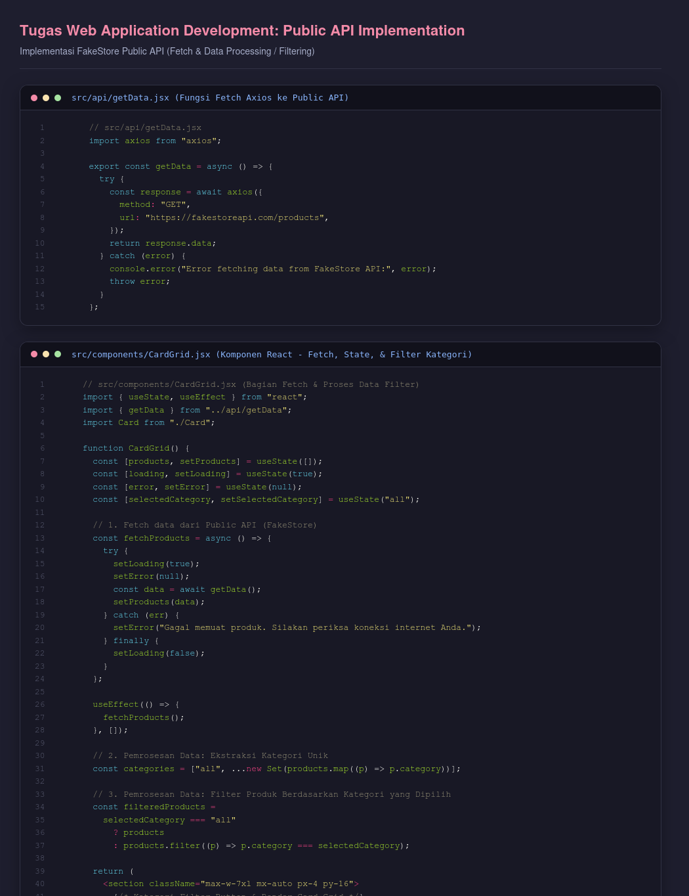

# INDIVIDU_WEBDEV
**Nama**: Brilliant Gibran Adhinata J.  
**NIM**: 25110300019  
**Mata Kuliah**: Web Application Development  
**Program Studi**: S1 Ilmu Komputer — Universitas Cakrawala  

---

## Tugas: Public API Implementation (Sesi: use-effect + api)

Implementasi integrasi Public API pada proyek e-commerce katalog produk **BrandKu** menggunakan **React**, **Vite**, dan **Tailwind CSS v4**.

### Sumber API
Public API yang digunakan: [FakeStore API](https://fakestoreapi.com)  
Endpoint: `https://fakestoreapi.com/products`

### Fitur yang Diimplementasikan
1. **Asynchronous Data Fetching**: Mengambil data produk secara otomatis saat komponen dimuat menggunakan `axios` dan hook `useEffect`.
2. **Pengolahan & Pemrosesan Data**:
   - Ekstraksi kategori unik secara dinamis dari response API menggunakan `Set`.
   - Filter produk interaktif berdasarkan kategori (*Semua Produk*, *Men's Clothing*, *Jewelery*, *Electronics*, *Women's Clothing*).
3. **Penyajian UI Komponen**:
   - Loading skeleton state saat data sedang di-fetch.
   - Error handling state jika terjadi kendala koneksi ke API.
   - Grid Card responsif yang menampilkan gambar produk, judul, tag kategori, rating bintang, jumlah ulasan, dan format harga.

---

### Bukti Pengumpulan Tugas

#### 1. Tampilan Hasil di Browser (Data Muncul Rapi)


#### 2. Kode Program (Fetch & Pemrosesan Data)


---

### Menjalankan Proyek Secara Lokal

```bash
# 1. Install dependencies
npm install

# 2. Jalankan development server
npm run dev

# 3. Build untuk produksi
npm run build
```
